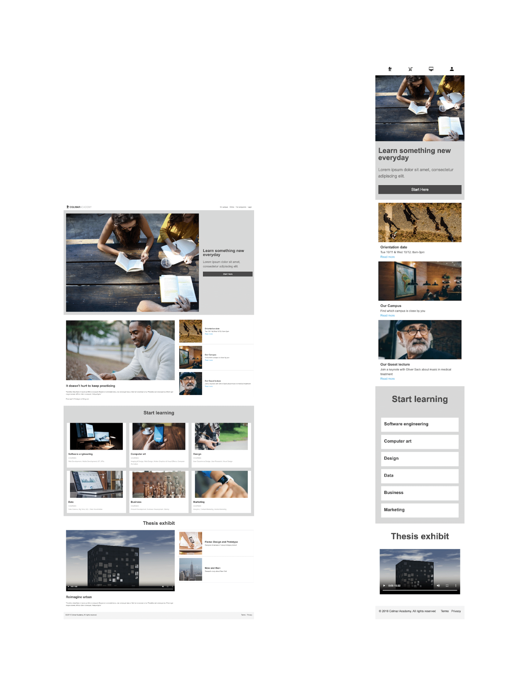
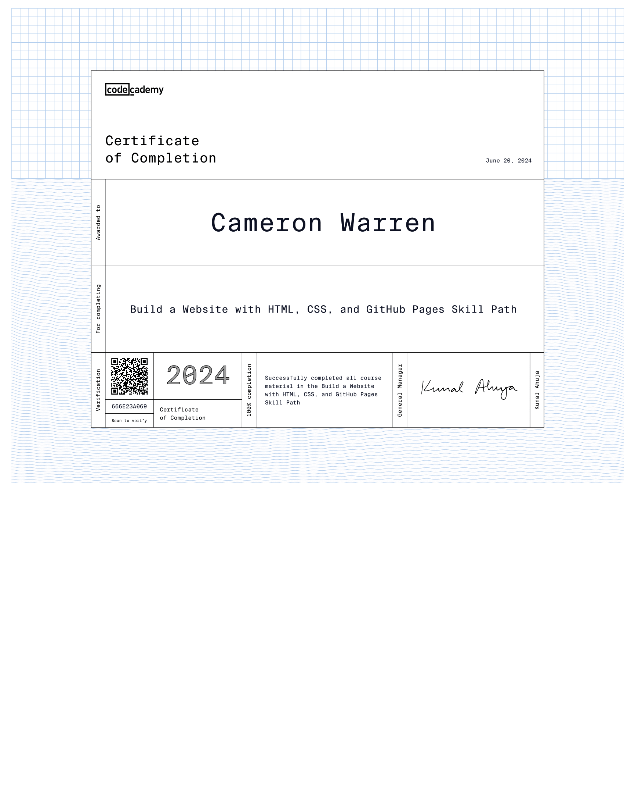

# Colmar Academy Website

## Project Overview

This project showcases the Colmar Academy website, built as a capstone project for the Codecademy course "Build a Website with HTML, CSS, and GitHub Pages." The primary objective of this project is to demonstrate the HTML and CSS skills I have acquired throughout the course.

## Purpose

The purpose of this project is to illustrate my ability to design and develop a responsive and visually appealing website using HTML and CSS. This project serves as a practical application of the concepts and techniques learned during the Codecademy course, culminating in the successful completion of the course and earning a certificate.

## Features

- **Responsive Design**: The website is fully responsive, ensuring a seamless experience across various devices, including desktops, tablets, and mobile phones.
- **Clean and Modern Layout**: The design focuses on a clean and modern aesthetic, with a user-friendly interface and easy navigation.
- **Multiple Sections**: The website includes several sections, such as the header, start section, explore section, learning section, thesis exhibit, and footer, each serving a specific purpose.
- **Media Integration**: The project integrates various media elements, including images and videos, to enhance the user experience.

## Drawbacks

- **Hyperlinks Unusable**: This project has hyperlinks that are not usable due to this website being based on a fictious company.
  
## Technologies Used

- **HTML5**: The structure and content of the website are built using HTML5, ensuring semantic and accessible markup.
- **CSS3**: The styling and layout of the website are achieved using CSS3, including responsive design techniques and media queries.

## Project Structure

The project is organized into the following main sections:

1. **Header**: Contains the logo, navigation links, and title of the website.
2. **Start Section**: Features a banner image and introductory content with a call-to-action button.
3. **Explore Section**: Showcases various aspects of the academy, including quotes, images, and additional information links.
4. **Start Learning Section**: Highlights different courses offered by the academy with descriptive content and images.
5. **Thesis Exhibit Section**: Displays thesis exhibits with video content and additional information.
6. **Footer**: Provides copyright information and links to terms and privacy policies.

## Installation

To view the project locally, follow these steps:

1. Clone the repository:
   ```sh
   git clone https://github.com/your-username/colmar-academy-website.git
   ```
2. Navigate to the project directory:
   ```sh
   cd colmar-academy-website
   ```
3. Open 'index.html' file in your web browser to view the website.
   
## Final Looks

### Desktop & Mobile View



## Reference Sheet

 

## Certificate of Completion

Successfully completing this project as part of the Codecademy course "Build a Website with HTML, CSS, and GitHub Pages" has earned me a certificate of completion, validating my skills and knowledge in web development.

 

## Author

**Cameron Warren**  
[GitHub](https://github.com/cwarre33)  
[LinkedIn]([https://www.linkedin.com/in/your-linkedin-profile](https://www.linkedin.com/in/cameron-warren-73a0192b2/))


   
   
   
